name: toc

```{css, echo=FALSE}
# CSS for including pauses in printed PDF output (see bottom of lecture)
@media print {
  .has-continuation {
    display: block !important;
  }
}
.remark-code-line {
  font-size: 95%;
}
.small {
  font-size: 75%;
}
.medsmall {
  font-size: 90%;
}
.scroll-output-full {
  height: 90%;
  overflow-y: scroll;
}
.scroll-output-75 {
  height: 75%;
  overflow-y: scroll;
}
```

```{r setup, include=FALSE}
options(htmltools.dir.version = FALSE)
library(knitr)
knitr::opts_chunk$set(
	fig.align = "center",
	out.width="80%",
	fig.height=4,
	cache = TRUE,
	dpi = 300,
  warning = F,
  message = F
)
```


1. [Seunghyun's overall thoughts/experiences on data visualization using R](#SL_thought)

1. [Basics of ggplot2](#ggplot2)

1. [Plotting examples](#examples)

1. [Colors and themes](#colors)

1. [Principles of data visualization](#principles)

1. [Case studies](#cases)


---
class: inverse, middle
name: SL_thought

# Seunghyun's overall thoughts/experiences on data visualization using R

---

# When do I use data visuzliation? 

Almost all the time..
* When exploring and checking data
* When documenting things for research projects
  - Documentation with good figures substantially lowers your switching cost/loading time 
  - Rmarkdown becomes a powerful tool if you document R scripts, equations, and figures in one place  
* When working with regressions 
* When reporting summary stats/results

---

# Thought process of visualization 
  - What is the main message to convey?
  - Is a figure preferred to a table or verbal description?
  - What figure will I draw? Which aspect do I want to emphasize?
    - spatial variation vs temporal variation?
    - overall trend or spatial variation? or particular group, space or time?
    - level, %, change, or difference?
    - cross-sectional variation? within-variation?

---

# spatial variation vs temporal variation?
```{r, echo=F, out.width="100%", out.height="100%"}

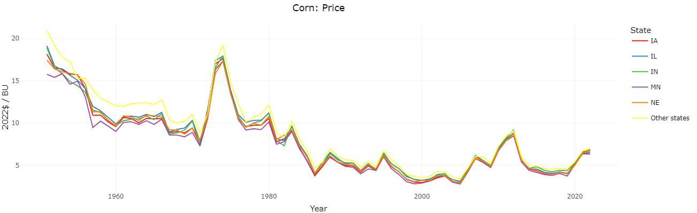
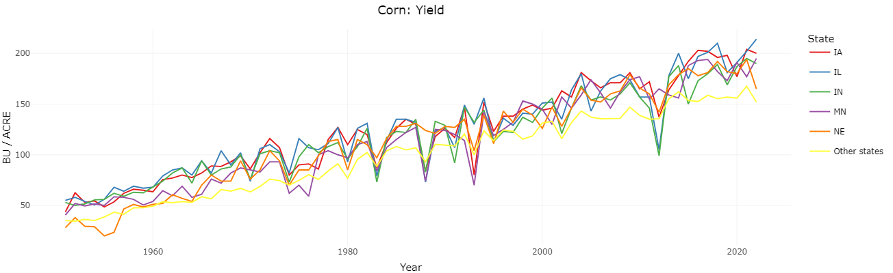
```
---

# spatial variation vs temporal variation?
```{r, echo=F, out.width="100%", out.height="100%"}
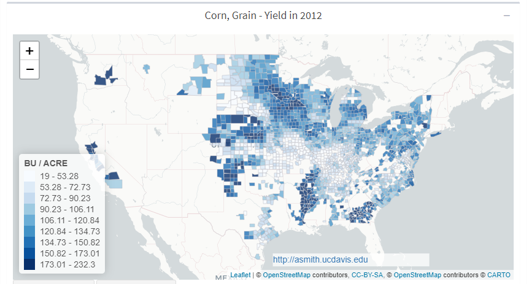
```
---


# overall trend vs particular time?

```{r, echo=F, out.width="100%", out.height="100%"}
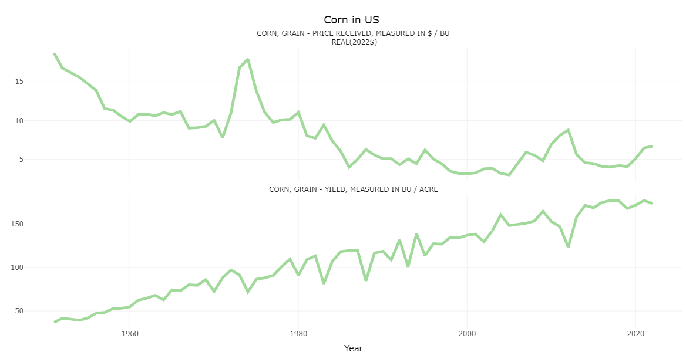
```

---

# overall trend vs particular time?
US corn and soybean yield
```{r, echo=F, out.width="70%"}
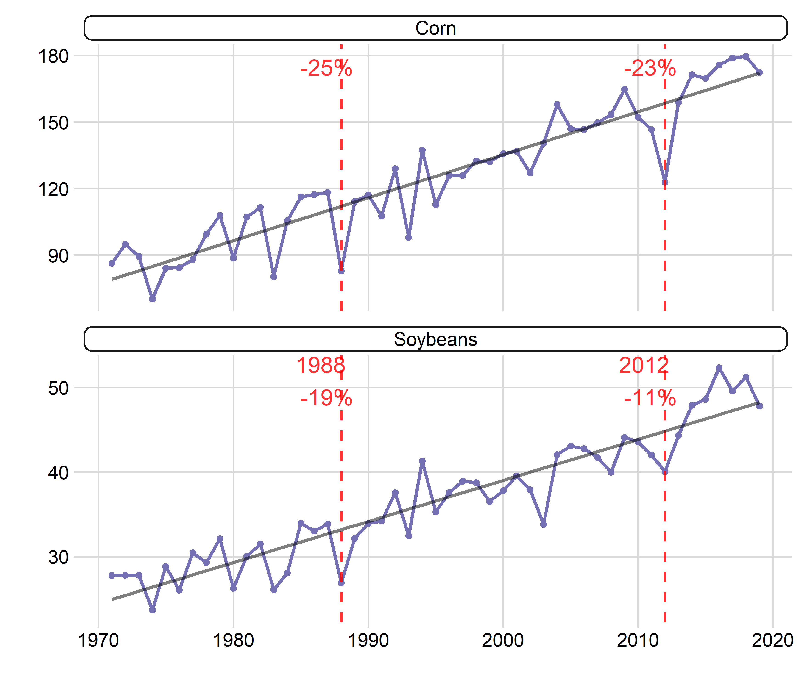
```


---

# overall trend vs particular time?

```{r, echo=F, out.width="100%", out.height="100%"}
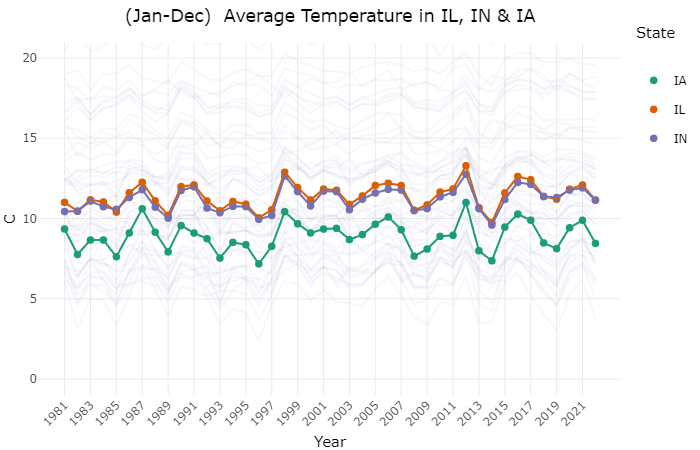
```

---

# overall trend vs particular time?

```{r, echo=F, out.width="100%", out.height="100%"}
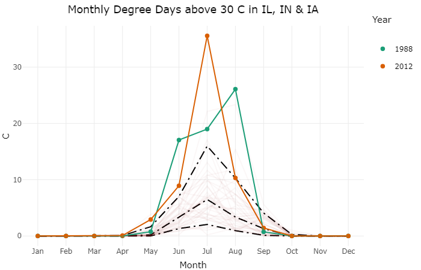
```


---

# cross-sectional vs within?

```{r, echo=F, out.width="100%"}
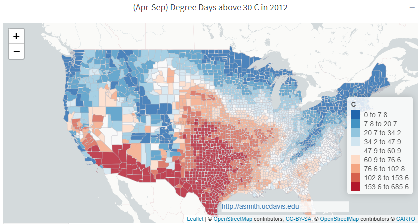
```


---
# cross-sectional vs within?

```{r, echo=F, out.width="100%", out.height="100%"}
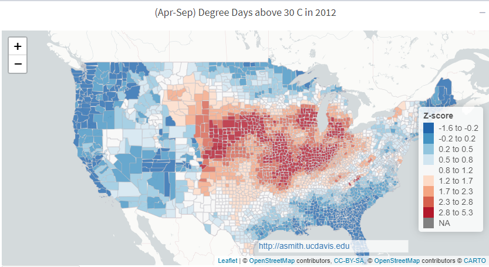
```

---

# level vs %?

acreage for corn & soy in 1988 & 2012
```{r, echo=F, out.width="100%", out.height="100%"}
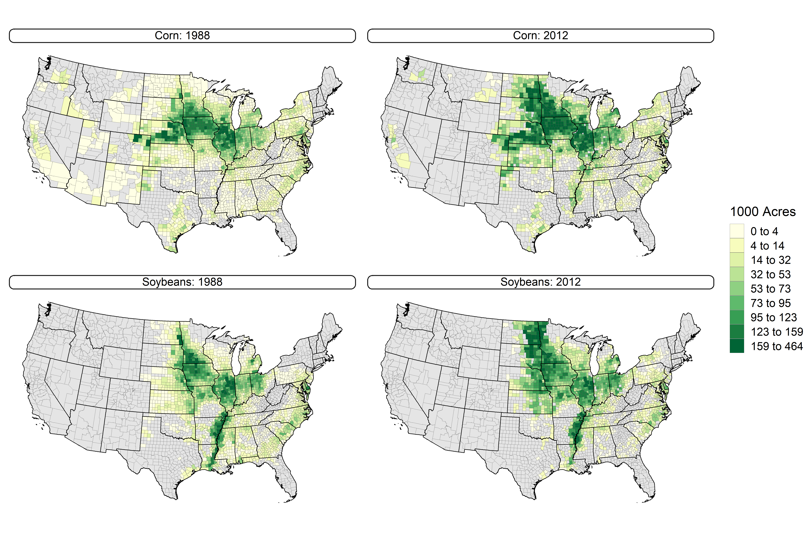
```

---

# level vs %?

% yield shock for corn & soy in 1988 & 2012
```{r, echo=F, out.width="100%", out.height="100%"}
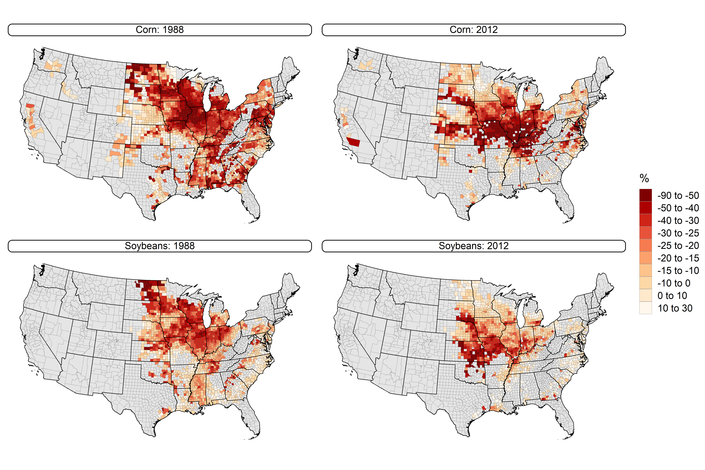
```


---
class: inverse, middle
name: examples

# Plotting examples

---

# Error bar plots
Let's first run regressions by continent and summarize results. 
(**Caution**: Don't take econometric soundness here.)
.small[
```{r error-bars}
#--- load packages ---#
library(data.table)
library(dslabs)
library(tidyverse)
library(broom)

#--- data to use  ---#
df <- data.table(gapminder)

#--- run regressions by continent ---#
df_results <- map(unique(df$continent), function(x) {
  df_in <- df[continent == x] # data for one continent

  # ....run regression for one continent and save results....#
  lm(log(infant_mortality) ~ log(population) + log(gdp), df_in) %>%
    tidy() %>%data.table() %>%
    .[, continent := x]
}) %>%
  rbindlist() %>% # bind results
  .[str_detect(term, "pop|gdp"), # drop results on intercept
    .(term, estimate, continent,
      # ....construct lower and upper bounds....#
      low = estimate - std.error * 1.96, high = estimate + std.error * 1.96)]

head(df_results)
```
]

---
# Error bar plots

.small[
```{r}
  ggplot(df_results, aes(x = continent, y = estimate)) +
   geom_point(size = 1.2) +
   geom_errorbar(aes(ymin = low, ymax = high, width = 0.2)) +
   geom_hline(yintercept = 0, color = "grey50") +
   facet_wrap(~term) +
   theme_bw() +
   labs(
     x = "Continent",
     y = "Point Estimate with 95% Confidence Interval",
     title = "Regressions of log infant mortality on population and GDP"
   )
```
]

---
# Error bar plots


.small[
```{r, fig.height=4.5, fig.width=8.5}
 ggplot(df_results, aes(x = term, y = estimate)) +
   geom_point(size = 1.2) +
   geom_errorbar(aes(ymin = low, ymax = high, width = 0.2)) +
   geom_hline(yintercept = 0, color = "grey50") +
   facet_wrap(~continent, nrow = 1) +
   theme_bw() +
   theme(axis.text.x = element_text(angle = 30, hjust = .5)) +
   labs(
     x = "Variables",
     y = "Point Estimate with 95% Confidence Interval",
     title = "Regressions of log infant mortality on population and GDP"
   )
```
]

